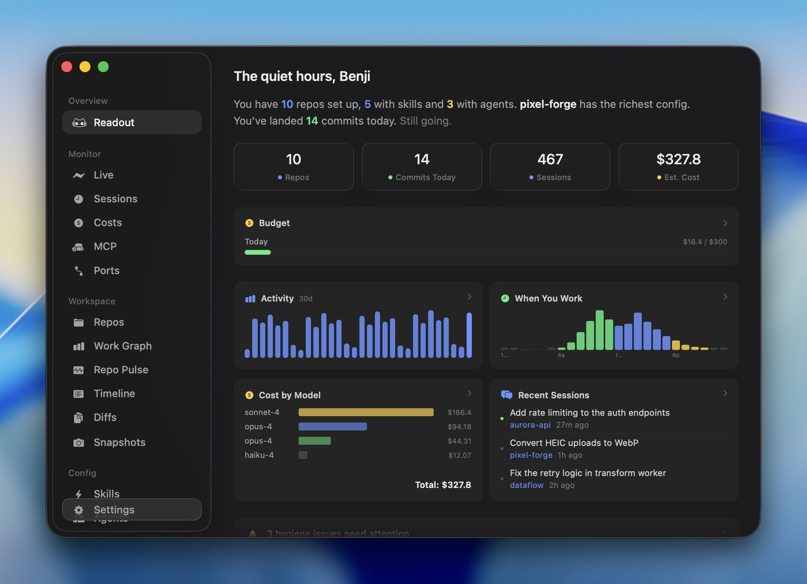

# good-design-tooling

A running list of tools I like using for design and development in the age of AI-assisted and agentic design workflows. Opinionated, not exhaustive. Updated as the space evolves.

Aimed at designers who write code and developers who design.

## Tools

### Claude Code + Ghostty

[Claude Code](https://claude.ai/code) is Anthropic's CLI for Claude — runs in your terminal, understands your codebase, and can execute multi-step tasks autonomously. Less "autocomplete in an editor", more "agent that can read, write, and run code across your project."

[Ghostty](https://ghostty.org/) is a native terminal emulator built for performance. The two pair well: Ghostty handles split panes and fast rendering, Claude Code handles the heavy lifting.

**Audio notifications when Claude Code finishes:** Claude Code supports hooks that fire on events. Add a `Notification` hook to `~/.claude/settings.json` to play a sound when it completes a task and hands control back to you — useful when running longer agentic tasks in the background.

```json
{
  "hooks": {
    "Notification": [
      {
        "hooks": [
          {
            "type": "command",
            "command": "afplay /System/Library/Sounds/Glass.aiff"
          }
        ]
      }
    ]
  }
}
```

Swap `Glass.aiff` for any file in `/System/Library/Sounds/` — `Ping.aiff`, `Funk.aiff`, etc.

### Cursor

[Cursor](https://www.cursor.com/) is an AI-first code editor. I use it alongside Claude Code rather than instead of it — Claude Code runs in the Cursor terminal and handles the agentic work, while Cursor stays open for when I actually need to read and navigate the code. The two complement each other well: Claude Code for execution, Cursor for understanding what's happening.

### UIFork

https://github.com/user-attachments/assets/6c85152e-414a-4b84-ad9a-fed033143f1b


[UIFork](https://github.com/sambernhardt/uifork) solves a real friction point in agentic UI work: you can generate a dozen variations with an agent, but switching between them without UIFork means branch-hopping or commenting out code.

It uses file-based versioning — `Button.v1.tsx`, `Button.v2.tsx` — with a floating widget for runtime hot-swapping. Each version is a real file, so agents can generate new ones directly, you can diff them, and promoting a winner is a single command.

```bash
npm install uifork
npx uifork src/components/MyComponent.tsx
npx uifork watch
```

### Agentation

https://github.com/user-attachments/assets/0931b357-3ac9-44ae-ac2e-d213e9e0e63e


[Agentation](https://www.agentation.com/) is a desktop tool for annotating live UI and passing that context to an agent. You hover over elements, add notes, and get back structured output — CSS selectors, file paths, component hierarchy — that an agent like Claude Code can act on directly.

The MCP integration makes it two-way: the agent can query annotations and respond with updates, so feedback becomes a conversation rather than a one-shot prompt.

### Rauno's Web Interface Guidelines

[interfaces](https://github.com/raunofreiberg/interfaces) by Rauno Freiberg is a living document of specific, opinionated details that separate good web UIs from mediocre ones — covering interactivity, typography, motion, touch, performance, and accessibility. Less "follow WCAG" and more "don't let hover states fire on touch press."

Worth keeping close when building with an agent: paste relevant sections into a `CLAUDE.md` as project rules, or install the Vercel skill below to apply them automatically during code review.

## Skills

Installable Claude Code skills that shape how an agent approaches UI and frontend work. Install with `npx skills add <skill>`.

### Anthropic Frontend Design

[anthropics/skills](https://github.com/anthropics/skills/blob/main/skills/frontend-design/SKILL.md) — Guides agents away from generic AI aesthetics toward distinctive, production-grade UI. Forces a committed aesthetic direction before any code is written: typography, color, motion, spatial composition. The explicit goal is avoiding the "AI slop" look — overused fonts, purple gradients, predictable layouts.

```bash
npx skills add anthropics/skills/frontend-design
```

### Emil Kowalski's Design Engineering Skill

[emilkowalski/skill](https://github.com/emilkowalski/skill/blob/main/skills/emil-design-eng/SKILL.md) — Emil's UI polish philosophy packaged as a skill: animation decisions, invisible details that compound, the principle that taste is trained not innate. When reviewing UI code, outputs a Before/After/Why table with specific, actionable changes. Companion to his [animations.dev](https://animations.dev/) course and [Agents with Taste](https://emilkowal.ski/ui/agents-with-taste) article.

```bash
npx skills add emilkowalski/skill
```

### Vercel Web Design Guidelines

[vercel-labs/agent-skills](https://github.com/vercel-labs/agent-skills/blob/main/skills/web-design-guidelines/SKILL.md) — Applies Rauno Freiberg's [Web Interface Guidelines](https://github.com/raunofreiberg/interfaces) as a code review. Give it a file or pattern, it fetches the latest guidelines and audits your UI code against them, outputting findings in `file:line` format.

```bash
npx skills add vercel-labs/agent-skills/web-design-guidelines
```

### Karpathy-Inspired Claude Code Guidelines

[andrej-karpathy-skills](https://github.com/forrestchang/andrej-karpathy-skills) — Addresses the specific failure modes Andrej Karpathy identified in LLM coding agents: silent assumptions, overcomplicated solutions, touching code they shouldn't. Four principles: think before coding, simplicity first, surgical changes, goal-driven execution.

```bash
# as a Claude Code plugin (applies across all projects)
/plugin marketplace add forrestchang/andrej-karpathy-skills
/plugin install andrej-karpathy-skills@karpathy-skills

# or per-project
curl -o CLAUDE.md https://raw.githubusercontent.com/forrestchang/andrej-karpathy-skills/main/CLAUDE.md
```

## Reading

Pieces worth sitting with — on craft, quality, and what design actually means as the tools around it keep changing. Includes articles and courses.

- [Design is more than code](https://linear.app/now/design-is-more-than-code) — Karri Saarinen on why the "should designers code" debate misses the point. The real question is whether you're doing the upstream work: understanding the problem, forming a concept, then executing. Tools and mediums are secondary.

- [Output isn't design](https://linear.app/now/output-isn-t-design) — Design is the search for fit between a form and its context. AI tools that generate polished-looking interfaces don't resolve the underlying tensions — they just make it easier to confuse production with problem-solving.

- [Why is quality so rare?](https://linear.app/now/why-is-quality-so-rare) — Karri Saarinen on the recurring cycle where new technology enables quality work, then gradually optimizes it away. Quality is a choice, requires taste, and — contrary to the usual assumption — is good business strategy.

- [Family Values](https://benji.org/family-values) — A close read of how the Family crypto wallet achieves its feel through three principles: simplicity via gradual revelation, fluidity through transitions that give the interface physical rules, and delight placed deliberately where it has the most impact.

- [Tools the Vercel Product Design Team Actually Uses](https://www.hannahhearth.com/posts/tools-the-vercel-product-design-team-actually-uses) — A snapshot of how a real design team is navigating a moment where tooling is fragmenting fast. No single solution; designers on the same team using completely different stacks, variable AI adoption, and an emerging split between canvas-based work and building directly in the browser.

- [animations.dev](https://animations.dev/) — Course by Emil Kowalski (design engineer at Linear) covering animation theory, CSS, and Framer Motion. Goes beyond syntax into what makes motion feel natural — easing, spring physics, timing, orchestration. Walkthroughs of how he builds and iterates on real components.

- [Agents with Taste](https://emilkowal.ski/ui/agents-with-taste) — Emil Kowalski on how to get agents to produce better visual work by codifying design principles explicitly. The core insight: almost every taste decision has a logical reason behind it — document that reasoning as a skill file and an agent can follow it consistently.

## To Be Tried

### Conductor


[Conductor](https://www.conductor.build/) is a macOS app for running multiple AI coding agents in parallel — Claude Code and Codex — each in isolated workspaces. Think of it as a management layer: spin up several agents on different tasks simultaneously, review their changes, then merge selectively. Potentially useful for parallelizing design iterations or running agents on independent parts of a project at once.

### Readout



[Readout](https://www.readout.org/) is a macOS dashboard that consolidates dev environment monitoring — logs, servers, processes — into a single interface instead of juggling terminal windows. Potentially a cleaner way to keep an eye on what's running when multiple agents are active.
